# From Turing Complete to a Real 8-Bit CPU

Every single computer, from phones to supercomputers, are build on one single idea: you can make any logival operation from a single type of gat called a NAND gate. This project is my attempt to go from that idea to a working CPU, first from a video game simulation then in hardware. 

I am using a game called Turing Complete to build each componet from scratch:  logic gates, adders, registers, RAM, and eventually a full CPU architecture. When I finish the game the goal is to replicate the design using physical components, and get it to work.

This project was started by me in Grade 10 with no hardware experiance. The devlog bellow is the record of what I made, what I got wrong, and what will eventually come. The goal is to finish a working physical CPU by the end of Grade 11.

**Goal:** Build a fully functional 8-bit CPU — starting from a video game, ending with real hardware.

**Started:** March 27, 2026 — Grade 10  
**Target:** Working CPU on a PCB by end of Grade 11

---

## The Plan

1. **Turing Complete** — Learn CPU architecture from scratch through the game
2. **Digital (simulator)** — Rebuild the CPU properly in a real EDA tool
3. **PCB design** — Turn the simulation into actual hardware using KiCad
4. **Run Snake** — Prove it works with something real

This repo documents every step, including mistakes.

---

## Progress

| Section | Status | Time Spent |
|---|---|---|
| Basic Logic | Complete | 1.3 hrs |
| Arithmetic & Memory | Complete | 7.4 hrs |
| CPU Architecture | Complete | 9.7 hrs |
| Programming | Complete | 14.5 hrs |
| CPU Architecture 2 | Complete | 28.1 hrs |
| Functions | In progress | — |
| Assembly Challenges | Not Started | — |
| Digital Simulation | Not started | — |
| PCB Design | Not started | — |
| Assembly | Not started | — |

---

## Chapter 1 — Basic Logic
### March 27, 2026

First session. Finished the entire Basic Logic section in one sitting.

The main thing I learned is something called **functional completeness**, the idea that you can build any logic circuit from nothing but NAND gates. Every AND, OR, XOR, NOT gate that exists can be made from combinations of NAND. This made me understand that everything can be made out of NAND.

The levels started simple, a single NAND gate, and built up to more complex combinations. By the end I was combining gates to build things I didn't fully understand yet but could get working through logic and brute forcing random combinations until something worked.

**Time:** 77 minutes  
**Takeaway:** NAND gates are all you need. Everything else is built on top of them.

#### Screenshots

*Level map — Basic Logic section fully completed (all green):*
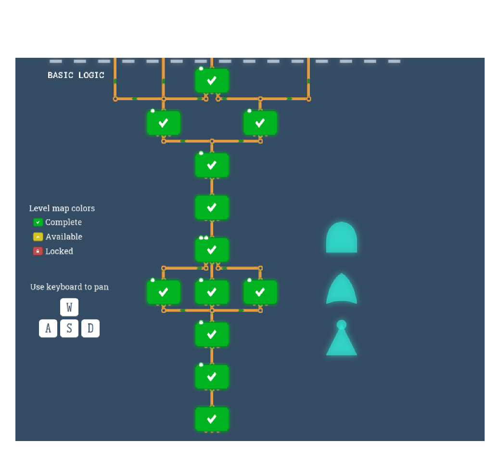

*AND, OR and NAND gate combinations — circuits getting more complex:*
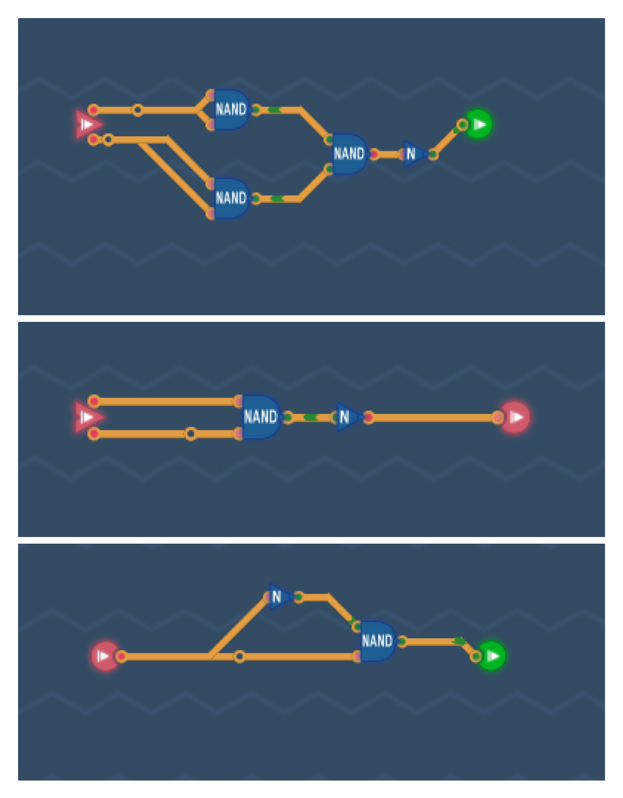

*XOR gate built from OR, NAND and AND — both inputs split into OR and NAND, their outputs fed into AND:*
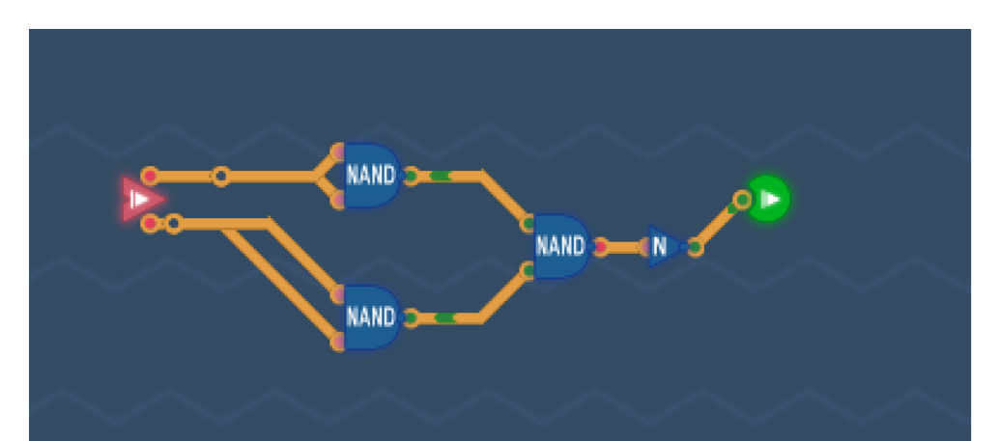

---

## Chapter 2 — Arithmetic & Memory
### March 30 – April 3, 2026

This section was a completely different difficulty level. Basic Logic felt like a warm-up. Arithmetic and Memory actually made me sit and think for a long time before anything worked.

### March 30 — First 15 Levels

Got through roughly half the section. Learned about bytes, built my first adder, and spent way too long confused about why some levels use bit wires and others use byte wires. The coloured wire system in Turing Complete represents different data widths and I kept mixing them up.

Once I actually understood that bits and bytes are handled by completely different components and you have to convert between them properly, everything became clearer. Should have figured that out sooner but the levels where I was stuck actually taught me more than the easy ones.

**Time:** 2.3 hours

*Progress map mid-way — roughly half complete, locked levels still showing red:*
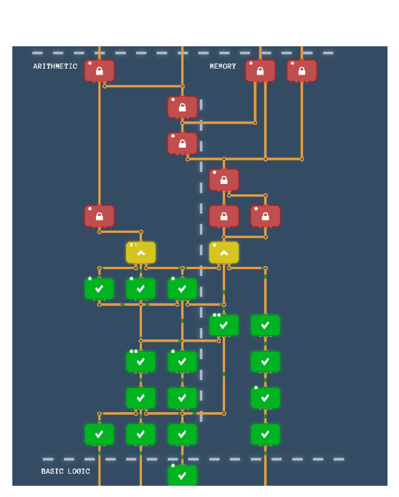

*Full adder — first time building real binary addition from scratch:*
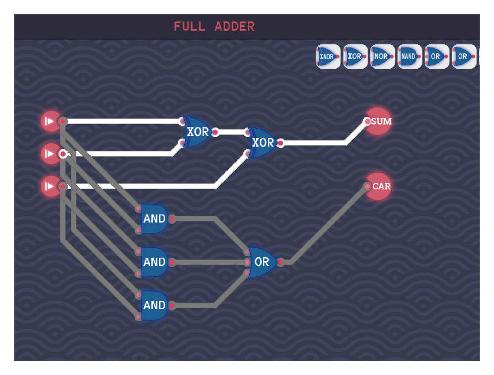

*8-bit adder (Adding Bytes) — chains 8 full adders together to add two full bytes:*
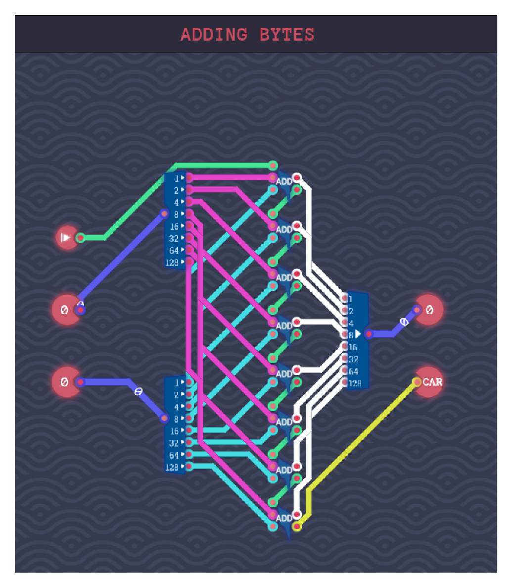

### April 3 — Section Complete

Finished everything. Built adders, registers, RAM, an input selector, a signed negator, a logic engine, and more. The jump from Basic Logic to this was massive — 5.1 hours in a single section compared to 1.3 hours for the first one.

The final level, **Little Box**, genuinely killed me. The workspace was tiny and I had to build something complex inside it. Spent a long time on it but eventually got it.

**Time:** 5.1 hours  
**Takeaway:** I now understand how memory actually works at the hardware level — registers, load/save signals, addressing, all of it. This wasn't just clicking through puzzles anymore. I had to think for some time before things started to work.

*Section fully completed — all levels green:*
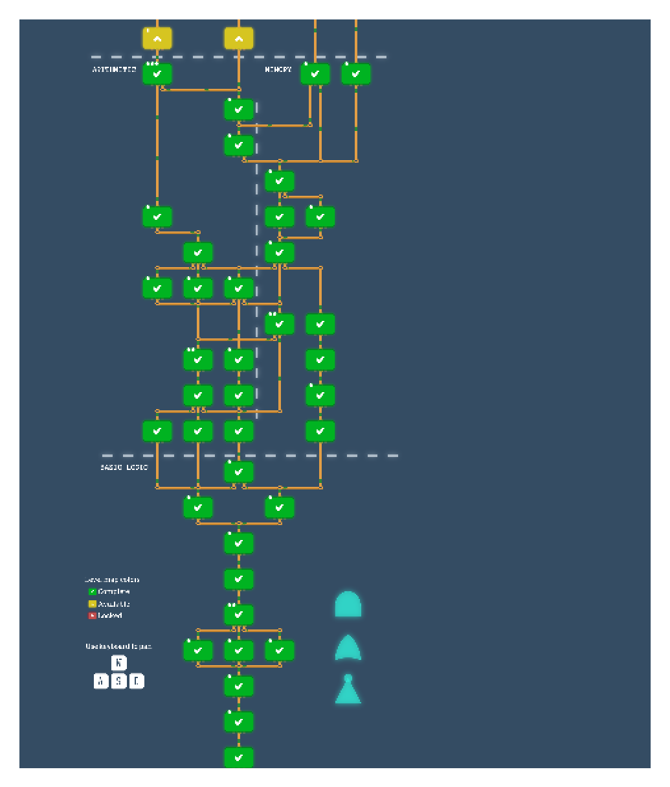

*Input Selector — routes one of two 8-bit inputs to the output based on a control signal:*
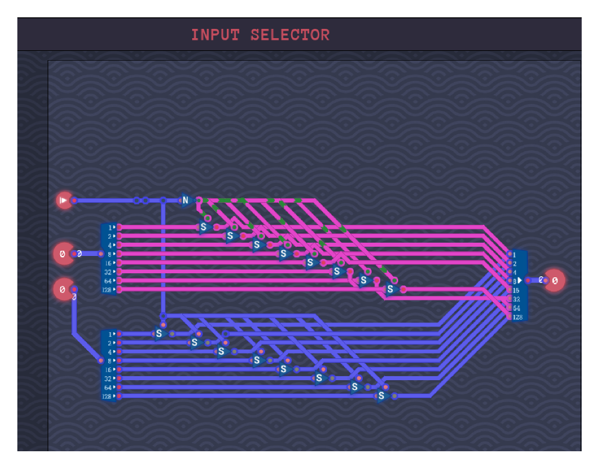

*Signed Negator — flips the sign of an 8-bit number using two's complement (NOT all bits, then add 1):*
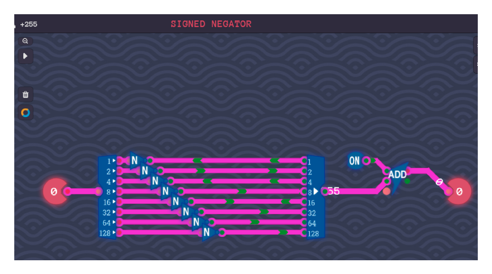

*Logic Engine — performs AND, OR, NOT operations on bytes, selected by an opcode:*
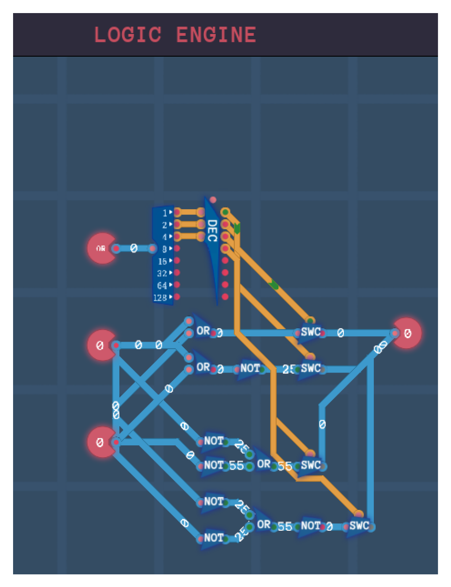

*Little Box — the final level. Tight space, lots of components, colour-coded everything just to survive it:*
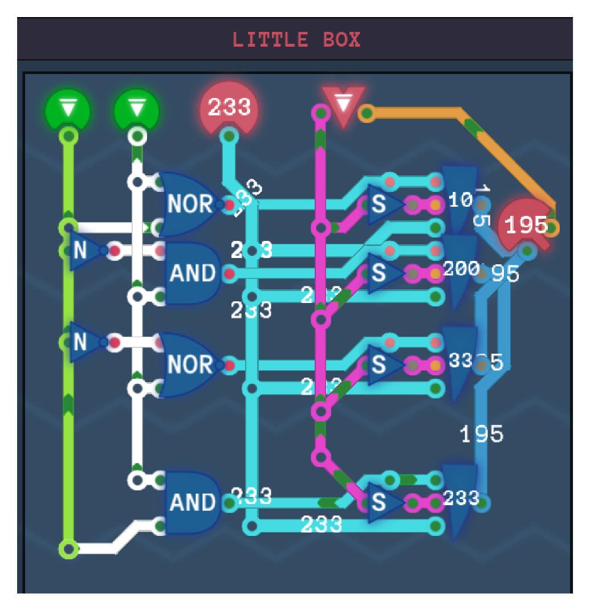

---

## Chapter 3 — CPU Architecture 

This is where everything from the first two chapters comes together into an actual CPU. The components I've already built — adders, registers, memory — are the building blocks. Now I'm connecting them into something that can fetch an instruction, decode it, and execute it.

### 13 April 2026 – Section Complete

Finished the entire CPU Architecture chapter! Built and connected every major component: Arithmetic Engine, Registers, Instruction Decoder, Program Counter, and the full control logic. Unlocked the **first working 8-bit computer** — it’s now a complete, functional CPU that can run real programs.  

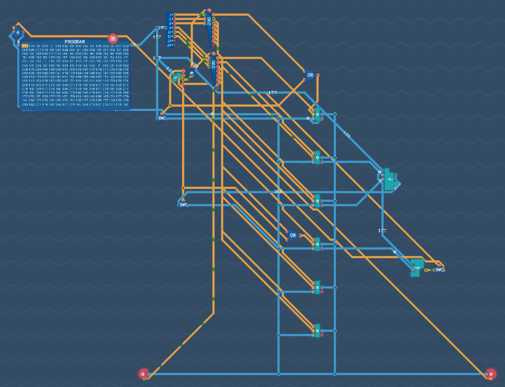

**Time:** 5.2 hours

**Biggest takeaway**  
This was the hardest chapter so far. Everything finally came together into one machine. I now have a real 8-bit CPU built completely from NAND gates. The moment the “Working Computer” component lit up felt amazing.

**Next**  
Programming & Assembly chapter — time to actually write code for the computer I just built.

---

## Chapter 4 — Programming

### April 20, 2026

Started the programming chapter. It is very differant from the previous chapters, no hardware only assembly. Assembly is far less fun than hardware, it takes far longer to click for me due to its ambigous nature with how the programming language is written. The level Spacial Invasio took a massive amount of time and playing around, to be honest I started to look for help online and I used some binary code that someone posted on Reddit. It is far harder than it looks written down on paper, everyone got their own assembly language and they do not give keys so you just stare and wonder what is this supposed to mean.

**Time:** 6.1 hours

**Takeaway:** 
Assembly is hard. Assembly is one of the most annoying things that I encountered. It is something that messes with your brain, things that on paper work do not work in the code. I must learn this language more.

#### Assembly code:
##### Spacial invasion:

5

reg0_to_out

1

reg0_to_out

1

reg0_to_out

1

reg0_to_out

0

in_to_reg3

15

reg3_nez

5

reg0_to_out

0

131

9

reg3_nez

3

reg0_to_out

0

131

9

reg3_nez

**Takeaway**:
This level taught me the true difficulty of assembly. Everything else is logical and makes sense, but this. 

### April 25, 2026

I Finally finished the programming chapter. I found out the brute force works also here, the level called The Maze shows how brute force is fantastic.

**Time:** 8.4 hours

**Takeaway:** 
Assembly is still hard, it is still frustrating but now I have found the joy of satisfaction when the computer does what it was meant to do. The level Storage Cracker was really easy, just add one and guess, The Maze on the other hand was frustration in its pure form. Brute force and spam are absolutly fantastic ways of finishing a level, they are not efficent in the slightest but they are the only thing that I am able to pull of for now.

#### Assembly code:

##### Storage Cracker:

0

reg0_to_reg3

reg3_to_out

1

reg0_to_reg1

label add_and_guess

reg3_to_reg2

add

reg3_to_out

add_and_guess

always_jmp

**Takeaway**:
The deffinition of brute force, adds one number starting from zero until the password is guessed.

##### The Maze:

1

reg0_to_reg1

label check_left

0

reg0_to_out

4

reg0_to_out

in_to_reg3

move_forward

reg3_eqz

turn_right

jump

label move_forward

1

reg0_to_out

check_left

jump

label turn_right

2

reg0_to_out

    
4

reg0_to_out

	
    
in_to_reg3

move_forward

reg3_eqz

turn_right

jump

**Takeaway**:
This code follows the left wall, it checks the left wall first then straight then right by doing so the robot will hug the wall and move forward. The robot will also fire the action command to make sure that it will not miss the door of the maze. 

---

## Chapter 5 — CPU Architecture 2 

### May 5, 2026

I did the first two levels of CPU Architecture 2, I defined the XOR gate and I made the 8 bit constant. The XOR gate was some assembly code, it did not take long to implement. The 8 bit constant took even less time to implement.

##### XOR:

in_to_reg0

reg0_to_reg1

in_to_reg0

reg0_to_reg2

nand

reg3_to_reg4

or

reg4_to_reg1

reg3_to_reg2

and

reg3_to_reg0

reg0_to_out

**Takeaway**:
This code is not optimised to its full potential it is just following what I built before with the physical parts but in writing.

**Time:** 1 hour

### May 12, 2026

I continued on with CPU Architecture 2. I made a byte xor which I previously did not have, it was a rather straight forward process. I also encountered the equals, greater than and less than. These components are relativly easy to solve if you put your mind to it. The hardest was less than as I did it before I did greater than, so it was a learning level that helped me understand the way to create greater than.

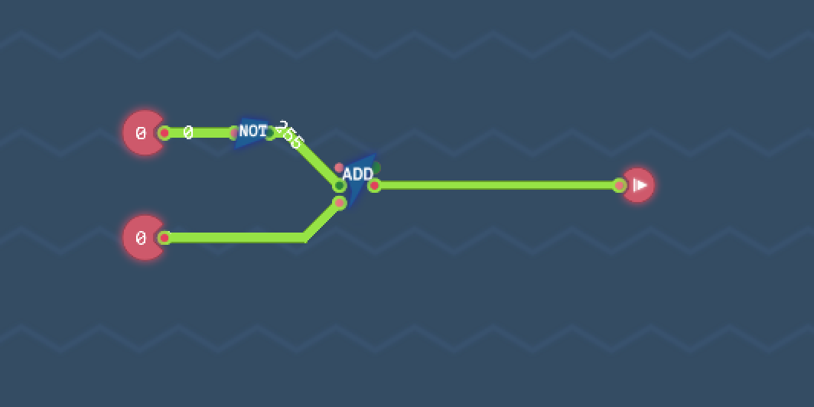

**Takeaway**:
We are back to hardware, it is fantastic.

**Time:** 2.5 hours

### May 19, 2026

I continued on with CPU Architecture 2. I did only two levels, the first level that I did was Wide Instructions. Wide Instructions was a easy level that did not take long and was quite clear to solve. The second level that I did, on the other hand was pure agony. Wire Spaghetti was a level that made me rethink who I am, I was stuck on it for so long that I can not even say. It was all possible but then I got stuck not knowing that you can change the increment that the counter does. This caused me to be stuck on the level for far longer than needed, in the end I found about the possiblity of doing that and I saved myself a whole load of time.

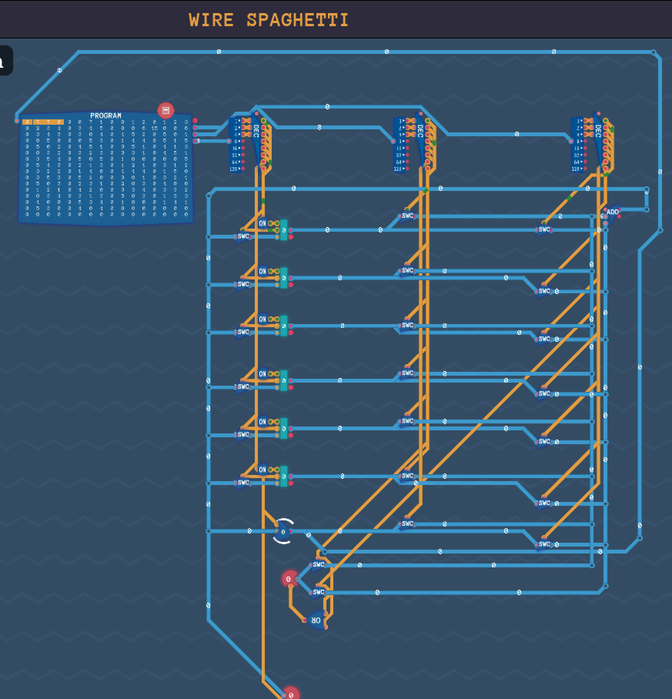

**Takeaway**:
I need to make sure I find out about the possibilities to change settings of components, as that stole a lot of time from me. 

**Time:** 7 hours

### May 31, 2026

I continued with CPU Architecture 2. I am almost at the end of this part. I have one final level for this part of the game. This was a very tiring time to play the game as I was sick.

**Time:** 9 hours

### July 2026 — Update

I got distracted for a couple of weeks and when i came back i found Turing Complete had an update and that broke the save files. So I switched to the old version to recover my progress. I am currently working on the Conditionals level, the circuit is constantly breaking on me. I am close to making this level work. 

## Chapter 6 — Functions

### July 9, 2026
I Have finished the level Conditionals, and I have officially finished with the CPU Architecture 2. I am now on the Functions chapter, I have only completed two levels in the Functions chapter. The Hex racer level, which required me to say what the hex codes are and the Shift level which made me make a shifter of bytes to the left. These levels are overall simple and I am looking forward to what I will face in this chapter.

**Time:** 9.6 hours(for the conditionals level) and 2 hours for the rest

## What's Next After the Game

Once the game(at least Functions) is done, the plan is:

**Step 1 — Rebuild in Digital (circuit simulator)**  
Take everything I designed in Turing Complete and rebuild it in [Digital](https://github.com/hneemann/Digital) — a proper EDA simulation tool. This produces clean schematics and lets me verify the design before touching any hardware.

**Step 2 — Design a PCB in KiCad, or an FPGA depending on location and if on break, or both**  
Turn the simulation into a real PCB layout. Order it from JLCPCB. The goal is something small, clean and portable — not a breadboard that falls apart in a bag.

**Step 3 — Write an assembler**  
Define my own instruction set (ISA) and write a Python script that converts human-readable assembly into the binary my CPU runs.

**Step 4 — Run Snake**  
The final proof that the CPU actually works — program it to run Snake. Display output, input handling, game loop, the whole thing.

---

## Resources I've Found Useful

- [Turing Complete](https://store.steampowered.com/app/1444480/Turing_Complete/) — the game this whole project started with
- [Digital](https://github.com/hneemann/Digital) — the simulator I'll use to rebuild the CPU
- [Ben Eater's 8-bit CPU series](https://eater.net/8bit) — YouTube series that heavily inspired the hardware phase
- [KiCad](https://www.kicad.org/) — for PCB design

---

*This project is being documented as it happens. Last updated: April 2026*
